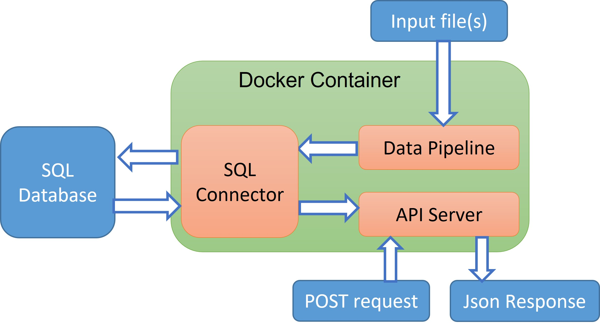

# 1. Introduction
`rokt` is an application that parses input text files  and then exposes an API for querying with POST requests. 

As a solution, the app is packaged in a Docker container that includes a SQL connector, a data pipeline, and an API server. The SQL database is connected externally to store parsed data.

The Docker image is first built from a `Dockerfile`. From the same image, multiple containers can be run to connect to different external databases. The database connection details are passed to the container at run time by using environment variables.

The SQL connector used python `SQLAlchemy` library, so this app does not have any raw SQL commands. The app can ideally connect to any types of SQL dialect, be it MySQL or PostgreSQL, Redshift, BigQuery, etc. 
At the moment two types of database are tested: `mysql+pymysql` (localhost MariaDB and AWS RDS) and `sqlite` (sqlite is stored in the container just for testing). 

The data pipeline uses `pandas` to reads every input files in chunks of 10,000 lines each. The chunks are then processed in a multi-threaded for loop by using `joblib`.

The API server uses `flask` to receive post requests, and return the responses in json format. The data is queried from the SQL database. 

The application uses `unittest` for testing the software when the container is run.

The GitHub repository can be seen by following this [link](https://github.com/HungDo1291/rokt).

# 2. Business assumptions
- The input files are stored in a folder that can be mounted to the container
- For every operation, the table `events` is dropped if existed and then recreated afresh. Then, input files are read from one folder and the API server is launched.
- All rows with incorrect or empty timestamps are dropped.

# 3. Deployment instructions

## 3.1 Build the image
Build the Docker image from Dockerfile by `docker build -t <image_name:tag> .` .

For example: `docker build -t rokt:v1 .`.
## 3.2 Run the container
### a) Commands
- Test with inbuilt sqlite database: `docker run -it --name <container_name>  -p 8279:8279 -e INPUT_PATH=<input_path> -e DATABASE_TYPE=sqlite <image_name:tag>`
- Production with an external SQL database: `docker run -it --name <container_name> -p 8279:8279 -e INPUT_PATH=<input_path> -e DATABASE_TYPE=<database_type> -e DATABASE_NAME=<database_name> -e USER=<user_name> -e PASSWORD=<password> -e HOST=<host> -e PORT=<port> -c <True/False>  <image_name>:<tag>`
- If you store the input files externally, you can mount the folder to docker container by `-v /path_to_yourfoler:/usr/src/app/input_or_any_where_else`. 
- For unit testing, run `python -m unittest rokt/tests/test_*.py`
### b) Examples
- For testing, run `docker run -it --name rokt_container_test -p 8279:8279 -e INPUT_PATH=/usr/src/app/rokt/resources/*.txt -e DATABASE_TYPE=sqlite rokt:v1` 
and the default values will be used, running sample input files and test sqlite database in this repository.
- Fot testing with the inbuilt `sqlite` but with different input files: `docker run -it --name rokt_container_test  -p 8279:8279 -v /external_path_to_yourfoler:/usr/src/app/input -e INPUT_PATH=/usr/src/app/input/*.txt -e DATABASE_TYPE=sqlite rokt:v1`.
- For production  with a locally hosted SQL database: `docker run -it --name rokt_container_prod -p 8279:8279 -e INPUT_PATH=/usr/src/app/rokt/resources/*.txt -e DATABASE_TYPE=mysql+pymysql -e DATABASE_NAME=my_db_name -e USER=root -e PASSWORD=my_password -e HOST=host.docker.internal -e PORT=3306 rokt:v1`. For Linux, add `--add-host host.docker.internal:host-gateway` option.
- To connect to AWS RDS for example, set the host to the RDS endpoint, for example `database-name.abcdefghijkkk.ap-southeast-2.rds.amazonaws.com`.

### c) Parameters

- INPUT_PATH: Path to the input file inside the container. If you have more than one file, you can use regex `*` such as `path/*.txt`. Default value is `/usr/src/app/rokt/resources/*.txt`. 
- DATABASE_TYPE: Type of database, for example `mysql+pymysql`. Default value is `sqlite`.
- DATABASE_NAME: The database name. Default value is `events`.
- USER: The username for the database. Default value is `root`.
- PASSWORD: The password for the database user. Default value is `my_pass`.
- HOST: The database host. Default value is `host.docker.internal`.
- PORT: The port for the database. Default value is `3306` (default port of MariaDB). 

# 4. Application usage
In order to send a request to the API server, you can use the command
`curl -X POST localhost:8279/ -d "{\"filename\":\"sample1.txt\", \"from\":\"1998-07-06T23:00:00Z\", \"to\": \"2020-07-06T23:00:00Z\"}"  --header "Content-Type: application/json"`

